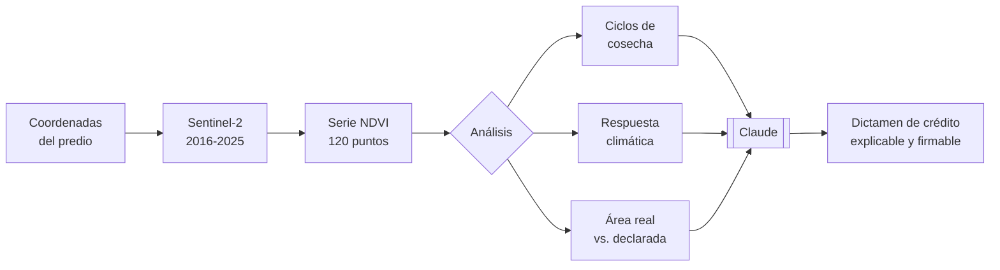

<div align="center">

# 🌱 SEEDLLITE

### Historial crediticio construido desde el espacio

**Hackathon Colombia Tech Week 2026 · Track 04 — Planeta y Comunidad · Resiliencia**

*Un pequeño productor sin extractos bancarios sí tiene historia financiera:*
*está escrita en diez años de imágenes satelitales de su parcela.*

</div>

---

## El problema

Para pedir un crédito agropecuario con recursos FINAGRO, a un campesino colombiano se le exige
un **balance financiero con fecha no mayor a 90 días**.

Un productor de 2,4 hectáreas de café en Pitalito no tiene contabilidad formal. No tiene
extractos. No tiene cómo producir ese documento.

**Ese solo requisito lo deja por fuera de un sistema que ya tiene el capital disponible y en el
que el Estado ya respalda hasta el 80% del riesgo.**

No falta plata. No falta garantía. **Falta una forma barata de evaluar.**

> Menos del 5% de los hogares rurales de América Latina accede a crédito formal.
> La brecha global de financiamiento agrícola supera los **USD 450.000 millones**.

---

## Qué hace SEEDLLITE

Sustituye el balance financiero que el pequeño productor no puede presentar por **evidencia
satelital que no puede falsificar**.



### La idea en una gráfica

Cuando se grafica el NDVI de una parcela mes a mes durante diez años, aparecen **dientes de
sierra**: sube durante el desarrollo del cultivo, cae en la cosecha, vuelve a subir.

**Cada diente es una cosecha terminada.** Y haber terminado nueve cosechas en diez años dice
más sobre la capacidad de pago de un campesino que cualquier balance que pudiera firmar.

---

## 🧠 Dónde está la IA, y por qué es el núcleo

**No usamos IA para clasificar píxeles.** Eso es procesamiento de señal, y existe desde los
años ochenta.

La IA hace lo que ningún modelo estadístico hace: **convierte una serie temporal en un
argumento de crédito auditable, escrito en el lenguaje de un comité que decide con plata de
por medio.**

| Sin IA | Con IA |
|---|---|
| `ndvi_pico = 0.78` | *"9 ciclos de cosecha completos entre 2016 y 2025, con rendimiento estimado de 1,42 t/ha frente a 1,14 t/ha del promedio municipal. La constancia del patrón productivo —y no su nivel puntual— sustenta la proyección de flujo."* |
| Un número | Una decisión que un analista puede firmar y un productor puede apelar |

Si se le quita la IA a SEEDLLITE, no queda producto: queda una gráfica que nadie sabe leer.

**El prompt vive en [`scripts/generar_dictamen.py`](scripts/generar_dictamen.py) y es legible.**
Es nuestro argumento entero de que la IA es el núcleo y no decoración.

---

## Los cuatro ejes de evaluación

**No los inventamos.** Están mapeados uno a uno contra los criterios que la **Circular Básica
Contable y Financiera, Capítulo II (SARC)** le exige a todo establecimiento de crédito en
Colombia.

| Eje | Peso | Criterio SARC que responde |
|---|---|---|
| **Capacidad de pago proyectada** | **40** | 1 · Capacidad de pago — *"flujos de ingresos y egresos"* |
| **Verificación del activo productivo** | **20** | 2 · Solvencia |
| **Riesgo sectorial y climático** | **25** | 5 · Variables sectoriales |
| **Coherencia del destino del crédito** | **15** | Resolución 08 de 2023 CNCA |

Para un pequeño productor agropecuario, **la capacidad de pago es la cosecha**. No hay otra
fuente de flujo. Por eso ese eje pesa más: porque es el criterio que la norma pone de primero.

### Lo que SEEDLLITE explícitamente NO evalúa

SEEDLLITE cubre **3 de los 5 criterios del SARC**. No reemplaza al comité de crédito: le
resuelve lo único que hoy no puede resolver.

- ❌ Historial en centrales de riesgo → le corresponde al intermediario
- ❌ Garantías → las aporta el FAG
- ❌ Endeudamiento con otras entidades → lo consulta el intermediario

---

## 🚩 Las dos verificaciones que hoy nadie hace

Ambas son obligaciones que el intermediario financiero **ya tiene**, y que hoy cumple firmando
sobre la palabra del solicitante.

### Viabilidad ambiental

En el Manual de Servicios de FINAGRO, el intermediario **certifica que el proyecto es técnica,
financiera y ambientalmente viable**. Sin ninguna herramienta para verificarlo.

SEEDLLITE cruza el polígono contra las capas oficiales:

| Capa | Norma | Efecto |
|---|---|---|
| Parque Nacional Natural | Decreto-Ley 2811 de 1974 · Ley 99 de 1993 | 🔴 Rechazo |
| Páramo delimitado | Ley 1930 de 2018 | 🔴 Rechazo |
| Reserva forestal Ley 2ª | Ley 2 de 1959 | ⚠️ Alerta — requiere acreditar sustracción |

> La reserva Ley 2ª genera alerta y no rechazo **de forma deliberada**: un rechazo automático
> castigaría al campesino con ocupación histórica, que es justamente el usuario que queremos
> incluir.

### Control anti-despojo

| Registro | Norma |
|---|---|
| **RTDAF** — Registro de Tierras Despojadas y Abandonadas Forzosamente | Ley 1448 de 2011 · Decreto 4829 de 2011 |
| **RUPTA** — Registro Único de Predios y Territorios Abandonados | Ley 387 de 1997 · Decreto 2007 de 2001 |

Predio inscrito → 🔴 rechazo automático con remisión a la Unidad de Restitución de Tierras.

La Ley 1448 establece **cinco presunciones de despojo** sobre los predios inscritos y presume
la ilicitud de las compras en zonas de violencia. Un banco que desembolse ahí está financiando
sobre título presuntamente viciado.

---

## 🛰️ Qué analiza el satélite — y qué no

Declarar los límites es lo que hace creíble el resto.

| # | Estudio | Método | Límite declarado |
|---|---|---|---|
| 1 | Serie NDVI de 10 años | `(B08−B04)/(B08+B04)`, mediana mensual | Sentinel-2 existe desde 2015 |
| 2 | Detección de ciclos | Conteo de picos y valles con umbral de amplitud | En perennes el ciclo es menos marcado |
| 3 | Área efectivamente cultivada | Fracción del polígono con estacionalidad de cultivo | 10 m: no distingue predios < 0,5 ha |
| 4 | Respuesta a estrés climático | Caída de vigor vs. el municipio | Correlación, no causalidad |
| 5 | Verificación ambiental | Intersección geométrica con capas oficiales | Depende de la vigencia de la capa |

### Lo que SEEDLLITE no puede ver

- No identifica la variedad del cultivo, solo la firma espectral compatible
- No ve bajo nube densa — por eso cada punto reporta su nubosidad
- **No acredita propiedad ni tenencia**
- **No detecta arrendamiento ni aparcería — ve la tierra, no el contrato**
- No sustituye la visita técnica cuando el intermediario la exija

---

## ⚖️ Alcance: territorios colectivos

SEEDLLITE v1 evalúa predios de **tenencia individual**. Los territorios colectivos —resguardos
indígenas y consejos comunitarios— quedan **excluidos del alcance**: su régimen de
inalienabilidad, imprescriptibilidad e inembargabilidad (art. 63 C.P.) exige un esquema de
garantía distinto que este modelo no aborda.

**Es una exclusión consciente, no un olvido.**

---

## 📡 Fuentes de datos y licencias

| Fuente | Uso | Licencia |
|---|---|---|
| **Copernicus Sentinel-2 L2A** | Serie NDVI e imágenes, 10 m, desde 2015 | Licencia abierta — **uso comercial permitido** |
| **Landsat / USGS** | Series históricas anteriores a 2015, 30 m | Dominio público |
| **EVA** — Evaluaciones Agropecuarias Municipales | Rendimiento por municipio y cultivo | Datos abiertos · `datos.gov.co` |
| **IDEAM** | Eventos climáticos y pronóstico estacional | Público |
| **UPRA** | Aptitud del suelo, índice de precios de agroinsumos | Público |
| **Manual de Servicios FINAGRO v.26.21** | Líneas, topes, clasificación de productor | Público |

> ⚠️ **No usamos los mosaicos Planet/NICFI**, pese a estar disponibles gratuitamente para
> Colombia: su licencia autoriza el uso únicamente para el "Propósito NICFI" y **no con ánimo
> de lucro**. Usarlos en un producto de crédito sería violación de licencia.
>
> *Contiene datos Copernicus Sentinel modificados, 2016–2025.*

---

## 🔍 Toda cifra es oficial o medida

**No hay una tercera categoría.** Cada número del dictamen cae en uno de estos dos grupos:

| Origen | Ejemplos |
|---|---|
| **Fuente oficial citada** | Rendimiento municipal (EVA 2018) · costo por hectárea del arroz ($6.335.618/ha — FINAGRO, MADR-DCAF/Fedearroz 2019) · clasificación de productor y cobertura FAG (Manual FINAGRO v.26.21) · criterios de evaluación (Circular Básica Contable y Financiera, Cap. II — SARC) |
| **Medido por nosotros** | Ciclos de cosecha detectados · área efectivamente cultivada · caída de vigor en la ventana de El Niño · colapso del patrón cíclico |

Lo que no cabe en ninguno de los dos grupos, **no entra al dictamen**. Los supuestos que
quedan están marcados `SUPUESTO:` en [`docs/criterios-de-credito.md`](docs/criterios-de-credito.md).

---

## ✅ Qué es real y qué es demostración

Sin ambigüedad, porque el jurado va a leer el código.

| Componente | Estado |
|---|---|
| **Dictámenes de crédito** | ✅ **Salidas reales de Claude**, generadas por [`scripts/generar_dictamen.py`](scripts/generar_dictamen.py) y commiteadas en [`data/dictamenes.json`](data/dictamenes.json) |
| **Pipeline de ingesta Sentinel-2** | ✅ Implementado y legible en [`scripts/ingesta_sentinel.py`](scripts/ingesta_sentinel.py). **No se ejecuta en vivo** en el demo por estabilidad de red |
| **Imágenes satelitales de los predios** | ✅ Capturas reales de Copernicus Sentinel-2 |
| **Marco normativo y criterios de crédito** | ✅ Verificado con fuente primaria citada |
| **Series NDVI** | ⚠️ **Calibradas** sobre la fenología documentada de cada cultivo, no descargadas en vivo |
| **Predios y productores** | ⚠️ **Ficticios.** Las coordenadas son de zonas productoras reales; las personas no existen |
| **Cruce RTDAF/RUPTA y capas ambientales** | ⚠️ Simulado en el demo. La verificación real requiere convenio con URT y descarga de capas oficiales |

**Todo lo marcado ⚠️ está rotulado también dentro de la interfaz.**

---

## 💰 Modelo de negocio

**No prestamos dinero. Vendemos la decisión.**

El capital ya existe (FINAGRO) y la garantía estatal también (FAG cubre hasta el 80% al pequeño
productor). Lo que falta es la capa de evaluación y monitoreo. Esa es la que construimos.

| | |
|---|---|
| **Cliente** | Bancos, cooperativas, microfinancieras y aseguradoras agropecuarias |
| **Modelo** | Cobro por dictamen de originación + suscripción de monitoreo satelital de cartera |
| **Por qué compran** | Hoy originar un crédito rural cuesta más de lo que rinde. Bajamos ese costo y les quitamos dos riesgos de certificación que hoy asumen a ciegas |
| **Expansión** | El mismo motor corre en cualquier país con catastro débil y satélite abierto |

Detalle completo en [`docs/modelo-de-negocio.md`](docs/modelo-de-negocio.md).

### Línea de expansión: restitución de tierras

La misma serie que evalúa crédito **puede corroborar una solicitud de restitución**. Un predio
con ciclos regulares durante años y una interrupción abrupta en fecha identificable, coincidente
con un desplazamiento documentado, es evidencia de abandono forzado producida por un tercero,
con fecha cierta, imposible de fabricar y anterior al litigio.

*Requiere Landsat (30 m, desde 1972), no Sentinel: el grueso del despojo colombiano es anterior a 2015.*

---

## 🚀 Cómo correrlo

**Sin instalación, sin dependencias, sin servidor.**

```bash
git clone https://github.com/laurodriguez2016-cmd/seedllite-ctw2026.git
cd seedllite-ctw2026
open index.html
```

Para regenerar los dictámenes con Claude:

```bash
export ANTHROPIC_API_KEY="tu-clave"
python3 scripts/generar_dictamen.py
```

---

## 📁 Estructura

```
seedllite-ctw2026/
├── index.html                      La aplicación completa, autocontenida
├── assets/satelite/                Capturas Sentinel-2, secuencia temporal por predio
├── scripts/
│   ├── ingesta_sentinel.py         Pipeline real de Copernicus
│   ├── generar_series_ndvi.py      Series NDVI calibradas por fenología
│   └── generar_dictamen.py         ⭐ El prompt del dictamen
├── data/
│   ├── predios.json                Los 4 predios del demo
│   ├── series_ndvi.json            120 puntos mensuales por predio
│   ├── dictamenes.json             Salidas reales de Claude
│   └── CONTRATO-DATOS.md           Esquemas acordados entre frentes
└── docs/
    ├── criterios-de-credito.md     ⭐ Los 4 ejes anclados al SARC
    ├── dictamen-modelo.md          La vara de calidad del prompt
    ├── modelo-de-negocio.md        Investigación de mercado y competencia
    ├── estructura-legal.md         Captación, tokenización, recaudo internacional
    └── tareas/                     Manual de trabajo del equipo
```

---

## 👥 Equipo

Tres abogados colombianos. Ninguno es ingeniero.

| | Frente |
|---|---|
| **Laura Rodríguez** | Criterios de crédito, marco normativo, validación jurídica de outputs |
| **Juan Torres** | Motor de datos satelitales y prompt del dictamen |
| **Juan Piedrahita** | Aplicación e interfaz |

El código lo escribe Claude Code. **El criterio de qué hace válido a un dictamen de crédito no
se delega** — y es lo que hace que este proyecto no lo pudiera construir un equipo sin abogados.

---

## ⚠️ Advertencia

> SEEDLLITE emite una **recomendación dirigida a un intermediario financiero vigilado**. No
> constituye oferta de crédito, promesa de desembolso ni asesoría financiera al productor. La
> decisión de otorgamiento corresponde exclusivamente al intermediario, conforme a su reglamento
> de crédito, al SARC y al Manual de Servicios de FINAGRO.
>
> Los predios y productores de esta demostración son **ficticios**.

---

<div align="center">

**El banco no tiene que confiar en el campesino.**
**Tiene que confiar en la evidencia.**

*Hackathon CTW 2026 · Universidad del Rosario · 15–16 de agosto de 2026*

</div>
