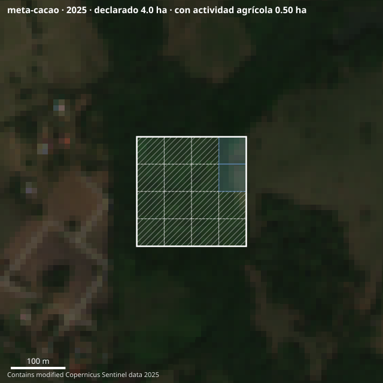
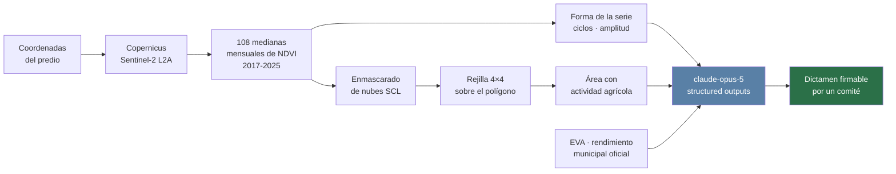
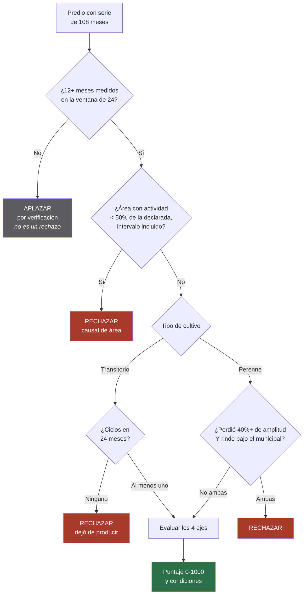
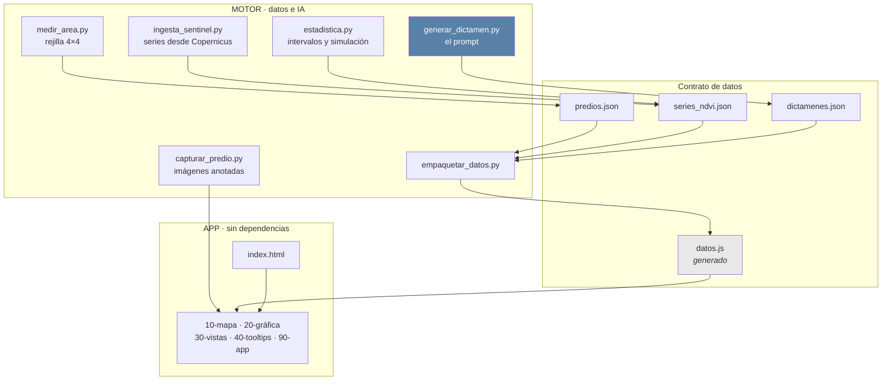

<div align="center">



# SEEDLLITE

### Originación y monitoreo satelital de crédito agropecuario

**Un campesino sin extractos bancarios sí tiene historia financiera.**
**Está escrita en nueve años de imágenes satelitales de su lote.**

<br>

[](https://seedllite-motor.vercel.app/app/)
[](https://youtu.be/LZD7oTlH_2A)


[](https://youtu.be/LZD7oTlH_2A)

*El demo también está en el repositorio: [`video/seedllite-demo.mp4`](video/seedllite-demo.mp4)*

<br>


</div>

---

<div align="center">

**9 lotes reales** · **108 meses medidos** · **US$0,18 por dictamen** · **0 dependencias**

</div>

---

## Contenido

| | |
|---|---|
| [El demo](#el-demo) | Video de 63 segundos y cómo abrirlo tú mismo |
| [El problema](#el-problema-en-un-párrafo) | Por qué el crédito no llega, y qué ordena la norma |
| [Cómo funciona](#cómo-funciona) | Del polígono al dictamen, paso a paso |
| [La lógica de decisión](#la-lógica-de-decisión) | Las causales y por qué el cultivo cambia la regla |
| [Los nueve predios](#los-nueve-predios) | Puntajes y decisiones reales |
| [Lo que sabe que no sabe](#lo-que-este-sistema-sabe-que-no-sabe) | Cobertura, intervalos y la decisión que la estadística volteó |
| [Cómo correrlo](#cómo-correrlo) | Sin instalar nada |
| [Estructura](#estructura) | Los tres frentes y el contrato de datos |
| [Trazabilidad](#toda-cifra-es-oficial-o-medida) | Fuentes, licencias y qué es real |

---

## El demo

<div align="center">

### [Ver el video — 63 segundos](video/seedllite-demo.mp4)

*Descárgalo o ábrelo desde el repositorio.*

</div>

**Lo que se ve, en orden:** el problema · el mapa de solicitudes · la serie NDVI de diez años
con los dientes de sierra de cada cosecha · el análisis paso a paso · **el dictamen
escribiéndose** · y el lote que SEEDLLITE **rechaza**, con la evidencia de por qué.

### Y si prefieres probarlo tú

```bash
git clone https://github.com/laurodriguez2016-cmd/seedllite-ctw2026.git
cd seedllite-ctw2026
open index.html
```

**Sin instalar nada.** Sin `npm`, sin servidor, sin build: doble clic sobre `index.html`.

> Para saltar directo a la toma que quieras:
> `index.html#mapa` · `index.html#cartera` · `index.html#dictamen/meta-cacao` (el caso rechazado)

---

## El problema, en un párrafo

Para pedir crédito con recursos FINAGRO, el banco le exige al productor un **balance con fecha
no mayor a 90 días** respecto del formulario de vinculación. Un campesino sin contabilidad
formal no puede producirlo. El capital existe, la garantía estatal existe —el FAG cubre hasta
el 80% al pequeño productor—: lo que falta es una forma barata de **evaluar**.

Visitar cada finca no es rentable. El satélite hace esa visita por **US$0,18**.

## Y la norma no solo lo permite: lo ordena

> *"En el caso de microcréditos, la entidad debe contar con una metodología que refleje de forma
> adecuada el riesgo inherente al deudor y **cuyos elementos permitan compensar las deficiencias
> de información del mismo, de acuerdo a sus características y grado de informalidad**. La
> información requerida **podrá ser obtenida y documentada en el lugar donde se desarrolla la
> actividad económica del deudor**."*
>
> — Circular Externa 100 de 1995, Cap. II lit. c · Superintendencia Financiera de Colombia

No estamos esquivando la regulación. Estamos construyendo la metodología que la norma lleva
treinta años exigiendo, y que nadie construyó porque la visita a campo no da los números.

---

## Cómo funciona



### La tesis: se lee la forma, no el nivel

Un predio abandonado **no tiene NDVI bajo**. Se llena de rastrojo y el verde sigue ahí. Lo que
desaparece es el **patrón**: deja de subir y bajar con el calendario del cultivo.

El predio que este sistema **rechaza** es el más verde de los nueve **en promedio**: mediana de
NDVI **0,836**, la más alta de la cartera. El predio de arroz que **aprueba** alcanza un pico más
alto —0,89 contra 0,88— pero su mediana es **0,539**, porque cae a suelo desnudo entre cosechas.

Ahí está todo el producto en dos cifras. Un modelo que mire cuánto verde hay aprueba el bosque y
duda del arrozal.

---

## La lógica de decisión



**Por qué el cultivo cambia la regla.** En un transitorio —arroz, papa— el suelo queda desnudo
entre siembras: si no hay diente de sierra, no hubo siembra. En un perenne —café, cacao— la
planta permanece todo el año y la cosecha no deja huella espectral. Aplicarle al café la regla
del arroz es un error de categoría, y durante media noche este sistema lo cometió: rechazaba a
su propio caso insignia de aprobación.

---

## Los nueve predios

Puntajes y decisiones **reales**, emitidas por `claude-opus-5` y commiteadas en
[`data/dictamenes.json`](data/dictamenes.json). Los lotes y las series son reales; los
productores son ficticios.

| Predio | Cultivo | Declarada → medida | Puntaje | Decisión |
|---|---|---|---|---|
| `meta-cacao-productivo` | Cacao · Granada | 4,5 → 4,50 ha | **900** | Aprobar |
| `huila-cafe` | Café · Pitalito | 2,4 → 2,25 ha | **870** | Aprobar con ajuste |
| `tolima-arroz` | Arroz · El Espinal | 6,1 → 6,10 ha | **850** | Aprobar |
| `boyaca-papa` | Papa · Ventaquemada | 1,8 → 1,80 ha | **750** | Aprobar con ajuste |
| `meta-cacao-sin-manejo` | Cacao · Granada | 3,8 → 2,61 ha | **750** | Aprobar con ajuste |
| `boyaca-papa-media` | Papa · Ventaquemada | 2,1 → 2,10 ha | **730** | Aprobar |
| `meta-cacao-vigor-bajo` | Cacao · Granada | 4,2 → 1,84 ha | **420** | Rechazar — *pendiente, ver nota* |
| `meta-cacao` | Cacao · Granada | 4,0 → **0,50 ha** | **240** | **Rechazar** |
| `boyaca-papa-nubes` | Papa · Ventaquemada | 1,6 → 1,60 ha | — | **Sin concepto** |

> **Nota — `meta-cacao-vigor-bajo` está pendiente de regenerar.** El dictamen que hay en el
> repositorio lo rechaza, pero la regla de área se endureció después de calcular los intervalos
> de confianza y **ese rechazo ya no procede** (ver más abajo). El dato se regenera corriendo
> `scripts/generar_dictamen.py meta-cacao-vigor-bajo`. Se deja visible en vez de corregirlo a
> mano: el dictamen es salida del modelo, y editarlo a mano rompería justo lo que hace creíble
> al resto.

---

## Lo que este sistema sabe que no sabe

Es la parte del proyecto de la que estamos más orgullosos.

### El sistema se niega a opinar cuando el dato no alcanza

`boyaca-papa-nubes` **parece un abandono perfecto**: cero ciclos en 24 meses y 65% de pérdida
de amplitud. Pero solo tiene **11 de 24 meses con observación utilizable**.

En el trópico andino la nube tapa entre 19 y 33 de los 108 meses, y sobre una ventana así de
incompleta **un predio nublado y uno abandonado producen exactamente la misma señal**. Negar el
crédito ahí sería castigar a alguien por el clima, con un argumento que se ve técnico y que el
productor no tiene cómo apelar.

El dictamen que emite el modelo le dice al comité, textualmente, que los indicadores de forma
**no deben leerse como evidencia de inactividad**, que los ejes van en cero porque no hay
concepto que emitir y no porque el predio saliera mal, y remite a visita técnica con la lista
de qué verificar.

### El umbral de cobertura dejó de ser una intuición

`scripts/estadistica.py` simula cuántas veces un predio que **sí produjo** quedaría declarado
inactivo, según cuántos meses se pudieron ver:

| Meses medidos de 24 | Probabilidad de falso negativo |
|---|---|
| 8 | 38,1% |
| 10 | 22,5% |
| **12 — umbral vigente** | **12,2%** |
| 14 | 5,7% |
| 16 | 2,4% |

### La estadística volteó una decisión nuestra

`meta-cacao-vigor-bajo` mide 7 de 16 celdas agrícolas: **43,8%**, por debajo del umbral del 50%
que dispara la causal de área. Pero su intervalo de Wilson al 95% va de **23,1% a 66,8%**. El
techo cruza el umbral, así que **no se puede afirmar que el predio esté por debajo**.

Ese rechazo se cayó. La causal ahora exige que el límite superior del intervalo también quede
bajo el umbral. El otro rechazo sobrevive sin problema: `meta-cacao` da 2 de 16 con techo en
36%, catorce puntos de holgura.

> Negar un crédito es un acto grave y quien lo recibe rara vez tiene cómo apelarlo. La regla no
> exige certeza absoluta: exige que la duda razonable no favorezca la negación.

---

## Cómo correrlo

**El demo no necesita credenciales.** Lee los JSON commiteados.

```bash
git clone https://github.com/laurodriguez2016-cmd/seedllite-ctw2026.git
cd seedllite-ctw2026
open index.html          # abre con doble clic, sin servidor ni build
```

Para regenerar los datos hace falta un `.env` con `CDSE_CLIENT_ID`, `CDSE_CLIENT_SECRET`
(Copernicus, gratuito) y `OPENROUTER_API_KEY`:

```bash
python3 scripts/ingesta_sentinel.py        # descarga las series de Copernicus
python3 scripts/medir_area.py --escribir   # mide el área con la rejilla 4×4
python3 scripts/calcular_incertidumbre.py --escribir
python3 scripts/capturar_predio.py         # capturas satelitales anotadas
python3 scripts/generar_dictamen.py        # los dictámenes con claude-opus-5
python3 scripts/empaquetar_datos.py        # emite data/datos.js
```

### Verificación

```bash
./verificar.sh      # contrato de datos, reglas de crédito, file://, secretos
./probar-app.sh     # las 21 rutas de la app en Chrome headless
```

`probar-app.sh` recorre la aplicación con JavaScript real y comprueba que cada pantalla termine
de armarse, incluida la animación de seis pasos de la pantalla de análisis.

---

## Estructura



**Cero dependencias, cero build, cero CDN.** La aplicación es HTML, CSS y JavaScript planos, y
debe abrir con doble clic sobre `index.html`. Bajo `file://` el navegador bloquea `fetch()` y
los módulos ES por CORS, así que los datos entran por una etiqueta `<script>`. Es el hallazgo
que documenta [`ARQUITECTURA.md`](ARQUITECTURA.md) §2, y `verificar.sh` lo vigila en cada
integración.

El motor es Python 3.9 con biblioteca estándar: `urllib`, `json`, `math`, `random`. La llamada
al modelo son ~25 líneas de `urllib` a propósito, para que cualquiera pueda leer exactamente
qué se le pidió al modelo sin confiar en el comportamiento de un SDK.

---

## Toda cifra es oficial o medida

No hay una tercera categoría. Las tres trampas de la API de Copernicus que costó encontrar
están comentadas en el código:

1. **Con CRS84 la resolución va en grados, no en metros.** Pedir `resx: 10` pensando en metros
   pide 10 *grados* y la API devuelve **un solo píxel por mes**, sin error ni advertencia.
2. **Un mes enteramente enmascarado vuelve como la cadena `"NaN"`**, no como `null`.
3. **Si en todo el año no hay escena bajo el umbral de nubes, la Process API no falla:**
   devuelve una imagen vacía de 1 KB.

Las tres son fallos silenciosos: el archivo queda bien formado y el número se ve plausible.

### Fuentes

| Dato | Fuente | Licencia |
|---|---|---|
| Serie NDVI | Copernicus Sentinel-2 L2A, Statistical API | Copernicus open licence |
| Imágenes | Copernicus Sentinel-2 L2A, Process API | Copernicus open licence |
| Rendimiento municipal | EVA · Evaluaciones Agropecuarias Municipales, MinAgricultura | Datos abiertos |
| Marco normativo | Circular Externa 100 de 1995, SFC · Manual de Servicios FINAGRO | Público |
| Salario mínimo 2026 | Decreto 1469 de 2025 | Público |

*Contains modified Copernicus Sentinel data 2017-2025.*

---

## Qué es real y qué es demostración

| Elemento | Estado | Detalle |
|---|---|---|
| Series NDVI | **Real** | Descargadas de Copernicus Sentinel-2 |
| Áreas detectadas | **Medido** | Rejilla 4×4 sobre imagen real |
| Dictámenes | **Real** | Salidas de `claude-opus-5`, commiteadas sin editar |
| Imágenes satelitales | **Real** | Con la medición dibujada encima |
| Rendimientos municipales | **Oficial** | EVA · MinAgricultura |
| Productores y montos | *Ficticio* | Construidos para el demo |
| Créditos desembolsados | *Ninguno* | Por eso no hay probabilidad de incumplimiento |

No hay un solo crédito desembolsado con este sistema, así que no existe con qué calibrar una
PD. Cualquier cifra de PD aquí sería inventada, y una cifra inventada en este proyecto no es un
desliz de estilo: destruye el argumento, porque el argumento **es** la trazabilidad.

---

## Lo que el satélite no ve

- **No ve el contrato.** Ve la tierra: no detecta arrendamiento ni aparcería.
- **No sustituye la visita técnica** cuando el intermediario la exige.
- **No evalúa centrales de riesgo, garantías ni endeudamiento con otras entidades.** Eso le
  corresponde al banco. SEEDLLITE cubre 3 de los 5 criterios del SARC y lo dice.

Declarar los límites es lo que hace creíble el resto.

---

<div align="center">

**Colombia Tech Week 2026** · Track 04 · Planeta y Comunidad

[](LICENSE)


</div>
