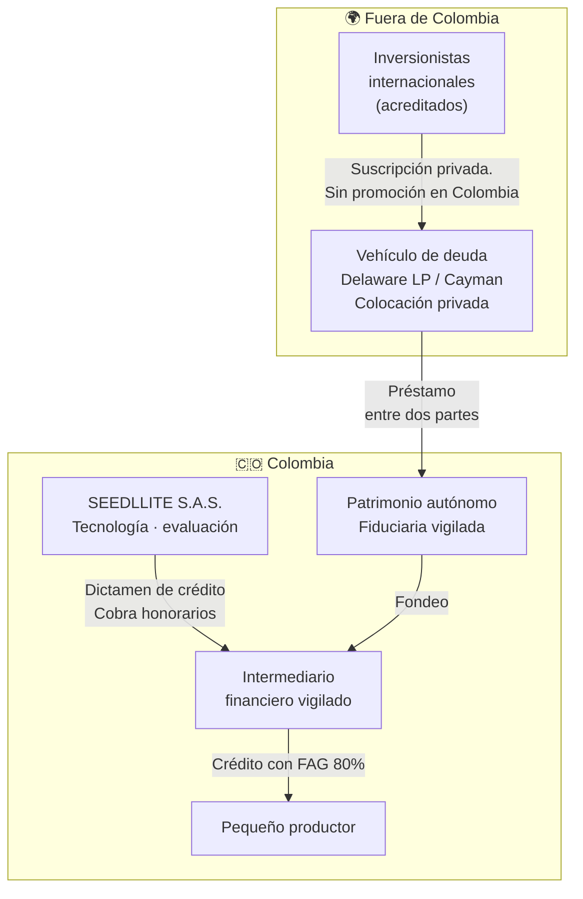

# ESTRUCTURA LEGAL DEL FONDEO — SEEDLLITE

> **Revisor natural: Juan Torres** (abogado tributarista CO/US/EAU · tokenización).
> Este documento responde una sola pregunta: **¿cómo se financia la operación sin incurrir
> en captación masiva y habitual de dineros del público?**
>
> ⚠️ **Alcance:** nada de esto se construye en el hackathon. Vive en el README como respuesta
> a los 15 puntos de "viabilidad y escala". **Cero líneas de código.**

---

## 1. Por qué esto importa desde el día uno

SEEDLLITE **no presta dinero**: vende la decisión de crédito a intermediarios vigilados. En ese
modelo no hay captación y no hay problema.

Pero la pregunta obvia del inversionista —y del jurado— es: *"¿y si además ponen el capital?"*
El margen está ahí. Y en el momento en que alguien piensa "levantemos plata de muchas personas
para prestarle a campesinos", **entra al terreno del artículo 316 del Código Penal.**

Diseñar mal esa estructura no es un riesgo regulatorio: **es un delito con pena de prisión.**

---

## 2. Qué es la captación masiva y habitual

### El tipo penal

**Art. 316 del Código Penal (Ley 599 de 2000):** quien desarrolle, promueva, patrocine, induzca,
financie, colabore o realice cualquier acto para **captar dinero del público en forma masiva y
habitual sin autorización previa** de la autoridad competente.

**Agravante:** si se usaron medios de difusión colectiva o redes sociales, la pena **se aumenta
hasta en una cuarta parte**.

**Art. 316A:** si además **no se reintegra el dinero**, se configura un tipo autónomo con pena
de **96 a 180 meses** (8 a 15 años) y multa de **133,33 a 15.000 SMMLV**.

### Cuándo se configura — Decreto 1981 de 1988, art. 1

🚨 **Los criterios son ALTERNATIVOS, no acumulativos. Basta que se cumpla uno.**

Este es el error que hunde a la mayoría de los proyectos: creen que hay que cumplir los tres.

| # | Criterio | Umbral |
|---|---|---|
| **1** | Número de personas | Obligaciones con **más de 20 personas**, o más de **50 contratos** de esta naturaleza |
| **2** | Proporción patrimonial | El valor total recibido **supera el 50% del patrimonio líquido** del receptor |
| **3** | Forma de captación | Las operaciones derivan de **oferta pública** o de **difusión colectiva dirigida a personas indeterminadas** — publicidad, redes sociales, volantes, mensajería masiva |

> **El criterio 3 es el más fácil de activar sin darse cuenta.** Un posteo en redes diciendo
> "invierte en crédito agrícola desde $500.000" cumple el criterio por sí solo, aunque solo
> respondan tres personas.

---

## 3. Las cinco rutas legales

| # | Ruta | Cómo evita la captación | Techo | Complejidad |
|---|---|---|---|---|
| **1** | **Capital propio y deuda bancaria** | No hay público: hay un acreedor institucional | Bajo | 🟢 Mínima |
| **2** | **Colocación privada** | No es oferta pública: dirigida a **menos de 100 inversionistas determinados**, sin publicidad ni difusión colectiva | Medio | 🟢 Baja |
| **3** | **Fondo de capital privado** administrado por sociedad vigilada (fiduciaria o comisionista) | La captación la hace una entidad **autorizada**; nosotros somos el gestor del activo | Alto | 🟡 Media |
| **4** | **Financiación colaborativa** (crowdfunding) por plataforma autorizada por la SFC | Actividad **expresamente reglamentada** — Decreto 1357 de 2018, modificado por Decreto 1235 de 2020 | Medio-alto | 🟡 Media |
| **5** | **Vehículo offshore** que presta a una entidad colombiana | La captación ocurre fuera y **sin promoción en Colombia** | Alto | 🔴 Alta |

### Sobre la ruta 4 — financiación colaborativa

Es la vía que el ordenamiento diseñó exactamente para esto.

- Solo pueden hacerla **sociedades de financiación colaborativa** con objeto exclusivo,
  autorizadas por la **Superintendencia Financiera**, las bolsas de valores y los sistemas de
  negociación o registro de valores.
- Los **aportantes no calificados** pueden invertir hasta el **20% de su patrimonio o de sus
  ingresos anuales**. Los calificados no tienen límite.
- El Decreto 1235 de 2020 **amplió los montos máximos** de financiación.

**Para nosotros:** no hay que crear la plataforma — **hay que aliarse con una existente.**
Constituir y hacer autorizar una sociedad de financiación colaborativa toma más de un año.

---

## 4. La estructura recomendada

### Por qué esta estructura no es captación

| Elemento | Razón |
|---|---|
| **La plata entra por un préstamo, no por captación** | Un mutuo entre dos personas jurídicas determinadas no es captación del público |
| **Ningún inversionista colombiano indeterminado aporta** | No se activa el criterio 3 del Decreto 1981 |
| **Menos de 100 inversionistas determinados, sin publicidad** | No es oferta pública en el sentido de la Ley 964 de 2005 |
| **El desembolso al productor lo hace un vigilado** | La actividad financiera la ejerce quien está autorizado |
| **Los recursos se aíslan en patrimonio autónomo** | Separación de riesgos y trazabilidad |

### 🔴 Las cuatro líneas que no se cruzan

1. **Ninguna promoción de la inversión dirigida al público colombiano.** Ni redes, ni
   webinars abiertos, ni "invierte desde $X". Eso solo activa el criterio 3.
2. **Ningún aportante colombiano indeterminado.**
3. **Nunca prometer rendimiento fijo garantizado** a personas indeterminadas.
4. **Concepto previo de la SFC** antes de cualquier ronda con componente colombiano.

---

## 5. Tokenización: cuándo un token se vuelve un valor

Juan: aquí está tu terreno, y aquí está la trampa.

### El estado de la regulación

En Colombia **no existe regulación específica de tokenización de activos financieros**. Pero
eso no significa vacío: se aplican las normas existentes de **valores** (Ley 964 de 2005,
Decreto 2555 de 2010) y de financiación colaborativa.

Los tokens que **representan valores** —acciones, deuda, participaciones en fondos— quedan
sujetos al Decreto 2555 y a supervisión de la SFC.

### La pregunta que decide todo

> **¿El token representa un derecho económico sobre un crédito o un portafolio?**
>
> **Si sí → es un valor.** Y su colocación al público es **oferta pública**, que exige
> inscripción en el Registro Nacional de Valores y Emisores.
>
> **Llamarlo "token" no lo saca del régimen. Lo mete.**

### Las tres salidas válidas

| # | Salida | Condición |
|---|---|---|
| **1** | **Colocación privada** | Menos de 100 inversionistas determinados, sin publicidad ni difusión colectiva |
| **2** | **Emitir a través de una plataforma de financiación colaborativa autorizada** | La entidad autorizada asume el régimen |
| **3** | **Emitir offshore bajo régimen extranjero**, sin promoción en Colombia | Ningún acto de promoción dirigido al público colombiano |

### Lo que sí aporta la tokenización — y no es evadir regulación

Un inversionista de impacto en Ámsterdam quiere financiar café en Huila. Hoy no tiene cómo:
el ticket mínimo es enorme, la liquidez es nula y no puede verificar en qué se gastó su dinero.

**Con la estructura tokenizada:**

| Aporte | Cómo |
|---|---|
| **Fraccionamiento** | Participación en un portafolio diversificado, no en un solo crédito |
| **Trazabilidad** | Cada crédito trae su dictamen y su serie satelital. **El inversionista ve el predio** |
| **Verificación continua** | El satélite reporta si el crédito se aplicó al cultivo declarado |
| **Impacto medible** | Hectáreas financiadas, productores incluidos, resiliencia climática — con evidencia satelital, no con un PDF |

> **Ese último punto es el diferencial real:** el capital de impacto paga por evidencia
> verificable, y hoy la recibe en informes autorreportados. Nosotros la producimos desde el
> espacio. **La tokenización no es el producto: es el envase que permite vender esa evidencia
> al capital internacional.**

---

## 6. Banderas rojas — señales de que la estructura se torció

- Alguien propone "abrirlo al público para que cualquiera invierta desde poco"
- Aparece publicidad de la oportunidad de inversión en redes
- Se promete un **rendimiento fijo garantizado**
- El número de aportantes se acerca a **20**
- Lo recibido se acerca al **50% del patrimonio líquido**
- Alguien dice *"como es un token, no aplica la regulación de valores"* ← **la más peligrosa**

---

## 7. Qué decimos en el hackathon

**En el README, una sección corta. En el video, nada.**

> *SEEDLLITE no capta recursos del público. Vende evaluación de crédito a intermediarios
> financieros vigilados. La expansión hacia el fondeo directo está diseñada sobre las rutas que
> el ordenamiento colombiano ya prevé —colocación privada, fondos administrados por entidades
> vigiladas y financiación colaborativa autorizada— y está documentada en
> `docs/estructura-legal.md`.*

Que el jurado vea que **el equipo pensó el problema regulatorio antes de que se lo pregunten**
vale más que cualquier proyección financiera.

---

## 8. Fuentes

| Tema | Norma / fuente |
|---|---|
| Captación masiva y habitual — tipo penal | Ley 599 de 2000, **arts. 316 y 316A** |
| Cuándo se configura la captación | **Decreto 1981 de 1988, art. 1** — criterios alternativos |
| Mercado de valores y oferta pública | **Ley 964 de 2005** · Decreto 2555 de 2010 |
| Financiación colaborativa | **Decreto 1357 de 2018**, modificado por **Decreto 1235 de 2020** |
| Tokenización | Sin regulación específica; aplican las normas de valores y crowdfunding |

Enlaces: [Ley 964 de 2005](https://www.funcionpublica.gov.co/eva/gestornormativo/norma.php?i=22412) ·
[Decreto 1357 de 2018](https://www.funcionpublica.gov.co/eva/gestornormativo/norma.php?i=87770) ·
[Análisis del art. 316](https://publicaciones.eafit.edu.co/index.php/nuevo-foro-penal/article/view/4758/pdf)

---

> ⚠️ **Este documento es análisis de diseño de estructura, no concepto jurídico.** Cualquier
> implementación real exige concepto previo de la Superintendencia Financiera y acompañamiento
> de firma especializada en mercado de capitales.

*15-ago-2026 · Pendiente de revisión de Juan Torres.*
